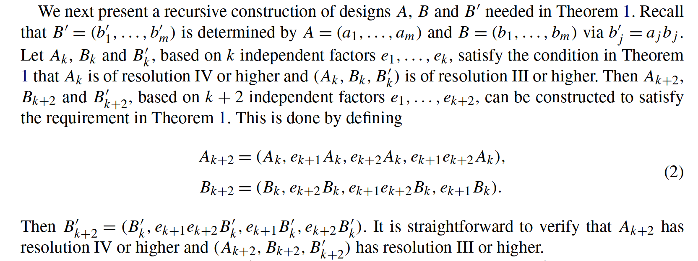
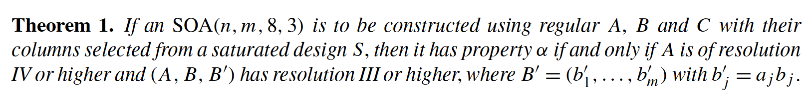
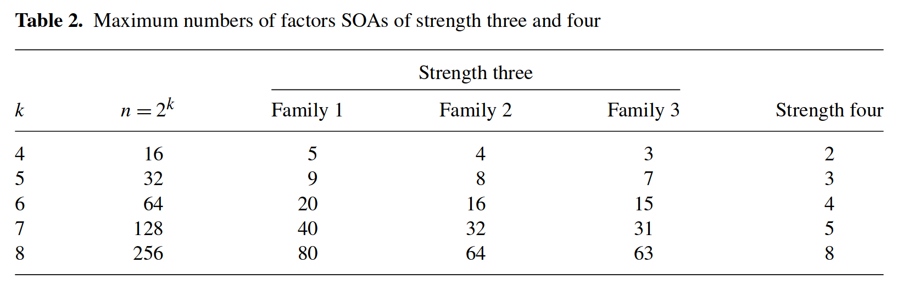

<!-- _class: cover -->

# Weekly Meeting

Topic: Issues regarding grouping and permutations

 

Presenter: Heng-Tse Chou @ NTHU STAT

Date: May 1, 2024

---

## Issues

1. Check if $m>8$ is possible, by trying different mutiplication to the permutation.
2. Dig into the grouping algorithm when $s=2$, and think about if it can be extended to $s=3$.

---

## Extendable grouping for $s=2$

From Shi and Tang, 2020.

---

## Extendable grouping for $s=2$

---

## Extendable grouping for $s=2$

---

## $k=4 \rightarrow k=6$

Assume we have $A_k$, $B_k$, $B_k'$, $B_k''$.

<!--
$$
A_{k+2} = (A_k, A_ke_{k+1}, A_ke_{k+1}^2, A_ke_{k+2}, A_ke_{k+2}^2, A_ke_{k+1}e_{k+2},  A_ke_{k+1}^2e_{k+2}^2,  A_ke_{k+1}e_{k+2}^2,  A_ke^2_{k+1}e_{k+2})
$$

$$
B_{k+2} = (B_k, B_ke_{k+2}, B_ke_{k+2}^2, B_ke_{k+1}e_{k+2},  B_ke_{k+1}^2e_{k+2}^2,  B_ke_{k+1}e_{k+2}^2,  B_ke^2_{k+1}e_{k+2}, B_ke_{k+1}, B_ke_{k+1}^2)
$$

$$
B'_{k+2} = (B'_k, B'_ke_{k+1}e_{k+2},  B'_ke_{k+1}^2e_{k+2}^2,  B'_ke_{k+1}e_{k+2}^2,  B'_ke^2_{k+1}e_{k+2}, B'_ke_{k+1}, B'_ke_{k+1}^2, B'_ke_{k+2}, B'_ke_{k+2}^2)
$$

$$
B''_{k+2} = (B''_k,  B''_ke_{k+1}e_{k+2}^2,  B''_ke^2_{k+1}e_{k+2}, B''_ke_{k+1}, B''_ke_{k+1}^2, B''_ke_{k+2}, B''_ke_{k+2}^2, B''_ke_{k+1}e_{k+2},  B''_ke_{k+1}^2e_{k+2}^2)
$$
-->

---

## $k=4 \rightarrow k=6$

- Now we have $m=8$ for $k=4, s=3$.
- 32 effects in total (full factorial: 40 effects).
- By the proposed method, we have $m=8\times9=72$ $k=6, s=3$.
- 288 effects in total (full factorial: 364 effects).

---

## A grouping for $k=4$

| $\alpha$  |  $\beta$  | $\alpha\cdot\beta$ | $\alpha\cdot\beta^2$ |
| :-------: | :-------: | :----------------: | :------------------: |
|   $14$    |   $23$    |       $1234$       |      $12^234^2$      |
|  $1^24$   |  $2^23$   |     $1^22^234$     |      $1^2234^2$      |
|   $24$    |  $1^23$   |      $1^2234$      |       $1234^2$       |
|  $2^24$   |   $13$    |      $12^234$      |     $1^22^234^2$     |
|   $123$   |  $12^24$  |      $1^234$       |      $2^234^2$       |
| $1^22^23$ |  $1^224$  |       $134$        |       $234^2$        |
|  $12^23$  | $1^22^24$ |       $234$        |      $1^234^2$       |
|  $1^223$  |   $124$   |      $2^234$       |       $134^2$        |

---

## Why $34$ cannot be put in $\alpha$ or $\beta$

Take the first row for example.

Instead of multiply by $(3, 4)$, we multiply it by $(3, 34)$.

| $\alpha$ | $\beta$ | $\alpha\cdot\beta$ | $\alpha\cdot\beta^2$ |
| :------: | :-----: | :----------------: | :------------------: |
|   $3$    |  $34$   |       $3^24$       |        $4^2$         |

---

## Why $34$ cannot be put in $\alpha$ or $\beta$

| $\alpha$  |  $\beta$  | $\alpha\cdot\beta$ | $\alpha\cdot\beta^2$ |
| :-------: | :-------: | :----------------: | :------------------: |
|   $13$    |   $234$   |      $123^24$      |      $12^24^2$       |
|  $1^24$   |  $2^23$   |     $1^22^234$     |      $1^2234^2$      |
|   $24$    |  $1^23$   |      $1^2234$      |       $1234^2$       |
|  $2^24$   |   $13$    |      $12^234$      |     $1^22^234^2$     |
|   $123$   |  $12^24$  |      $1^234$       |      $2^234^2$       |
| $1^22^23$ |  $1^224$  |       $134$        |       $234^2$        |
|  $12^23$  | $1^22^24$ |       $234$        |      $1^234^2$       |
|  $1^223$  |   $124$   |      $2^234$       |       $134^2$        |

---

## Why $34$ cannot be put in $\alpha$ or $\beta$

- (1, 2) and (7, 3) are duplicated.

- (1, 3) and (4, 4) are duplicated.

---

## After meeting

1. Hold the validation of $m>8$ and the grouping for $k=3$.
2. Some issues with `strength.py` since the $A$ with $m=8$ does not have enough degrees of freedom to have strength 5.
3. Look into property $\beta$. It should be quick because it resembles the construction of property $\alpha$.
4. If there is still time, look into property $\gamma$.

---

<!-- _hide: true -->

## Notes

_Hidden page_

**The number of effects:**

- $k=2$: 4
- $k=3$: 13 (=4x3+1)
- $k=4$: 40 (=13x3+1)
- $k=5$: 121
- $k=6$: 364

---

<!-- _hide: true -->

## Notes

_Hidden page_

**Formula:**

1. $\sum_{i=1}^kC_i^k2^{i-1}$
2. $\frac{3^k-1}{2}$
