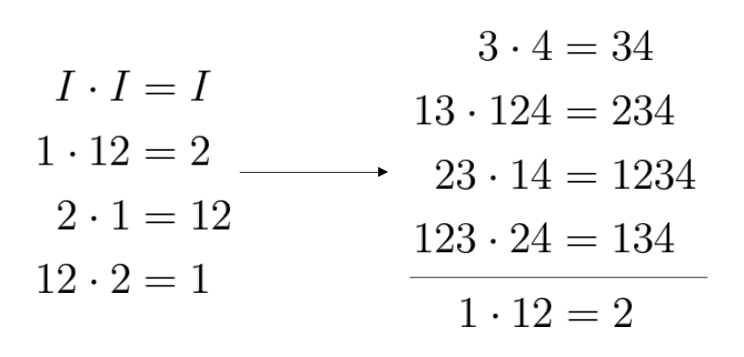

<!-- _class: cover -->

# Weekly Meeting

Topic: Need $A$ to be resolution $IV$

 

Presenter: Heng-Tse Chou @ NTHU STAT

Date: Jun. 19, 2024

---

### Issues

1. Property $\alpha$ with design $A$ having resolution $IV$.
2. Property $\beta$ with design $A$ having resolution $IV$.

---

### Property $\alpha$

$\text{SOA}(n, m, 27, 3)$ has property $\alpha$ iff:

1. $A$ is resolution $IV$.
2. $(B, B', B'')$ is resolution $III$, i.e., no repeated columns.

---

### Property $\beta$

$\text{SOA}(n, m, 27, 3)$ has property $\beta$ iff:

1. $A$ is resolution $IV$.
2. $(B, B', B'') \subseteq \bar{A}$.
3. $(B, B', B'')$ contains no 2 factor interaction from $A$.

---

### Property $\alpha$ for $k=4$

| $\alpha$  |  $\beta$  | $\alpha\cdot\beta$ | $\alpha\cdot\beta^2$ |
| :-------: | :-------: | :----------------: | :------------------: |
|   $14$    |   $23$    |       $1234$       |      $12^23^24$      |
|  $1^24$   |  $2^23$   |     $1^22^234$     |      $1^223^24$      |
|   $24$    |  $1^23$   |      $1^2234$      |       $123^24$       |
|  $2^24$   |   $13$    |      $12^234$      |     $1^22^23^24$     |
|   $123$   |  $12^24$  |      $1^234$       |      $2^234^2$       |
| $1^22^23$ |  $1^224$  |       $134$        |       $234^2$        |
|  $12^23$  | $1^22^24$ |       $234$        |      $1^234^2$       |
|  $1^223$  |   $124$   |      $2^234$       |       $134^2$        |

---

### Property $\alpha$ with $k=4$

This construction provides $D$ with 8 factors (8/10).

---

### Property $\alpha$ with $k=6$

|       $\alpha$        |        $\beta$        |      $\alpha\cdot\beta$      |      $\alpha\cdot\beta^2$      |
| :-------------------: | :-------------------: | :--------------------------: | :----------------------------: |
|   $5\cdot A_{(1)}$    |   $6\cdot B_{(1)}$    |   $56\cdot A_{(1)}B_{(1)}$   |  $56^2\cdot A_{(1)}B_{(1)}^2$  |
|  $5^2\cdot A_{(1)}$   |  $6^2\cdot B_{(1)}$   | $5^26^2\cdot A_{(1)}B_{(1)}$ |  $5^26\cdot A_{(1)}B_{(1)}^2$  |
|   $6\cdot A_{(1)}$    |  $5^2\cdot B_{(1)}$   |  $5^26\cdot A_{(1)}B_{(1)}$  |   $56\cdot A_{(1)}B_{(1)}^2$   |
|  $6^2\cdot A_{(1)}$   |   $5\cdot B_{(1)}$    |  $56^2\cdot A_{(1)}B_{(1)}$  | $5^26^2\cdot A_{(1)}B_{(1)}^2$ |
|   $56\cdot A_{(2)}$   |  $56^2\cdot B_{(2)}$  |  $5^2\cdot A_{(2)}B_{(2)}$   |  $6^2\cdot A_{(2)}B_{(2)}^2$   |
| $5^26^2\cdot A_{(2)}$ |  $5^26\cdot B_{(2)}$  |   $5\cdot A_{(2)}B_{(2)}$    |   $6\cdot A_{(2)}B_{(2)}^2$    |
|  $56^2\cdot A_{(2)}$  | $5^26^2\cdot B_{(2)}$ |   $6\cdot A_{(2)}B_{(2)}$    |  $5^2\cdot A_{(2)}B_{(2)}^2$   |
|  $5^26\cdot A_{(2)}$  |   $56\cdot B_{(2)}$   |  $6^2\cdot A_{(2)}B_{(2)}$   |   $5\cdot A_{(2)}B_{(2)}^2$    |

---

### Property $\alpha$ with $k=6$

Where

$A_{(1)} = (14, 1^24, 24, 2^24)$

$A_{(2)} = (123, 1^22^23, 12^23, 1^223)$

$B_{(1)} = (23, 2^23, 1^23, 13)$

$B_{(2)} = (12^24, 1^224, 1^22^24, 124)$

This construction provides $D$ with 32 factors (32/91).

---

### Grouping with $A$ not having res. $IV$

|    $\alpha$     |     $\beta$     | $\alpha\cdot\beta$ | $\alpha\cdot\beta^2$ |
| :-------------: | :-------------: | :----------------: | :------------------: |
|   $5\cdot A$    |   $6\cdot B$    |    $56\cdot AB$    |   $56^2\cdot AB^2$   |
|  $5^2\cdot A$   |  $6^2\cdot B$   |  $5^26^2\cdot AB$  |   $5^26\cdot AB^2$   |
|   $6\cdot A$    |  $5^2\cdot B$   |   $5^26\cdot AB$   |    $56\cdot AB^2$    |
|  $6^2\cdot A$   |   $5\cdot B$    |   $56^2\cdot AB$   |  $5^26^2\cdot AB^2$  |
|   $56\cdot A$   |  $56^2\cdot B$  |   $5^2\cdot AB$    |   $6^2\cdot AB^2$    |
| $5^26^2\cdot A$ |  $5^26\cdot B$  |    $5\cdot AB$     |    $6\cdot AB^2$     |
|  $56^2\cdot A$  | $5^26^2\cdot B$ |    $6\cdot AB$     |   $5^2\cdot AB^2$    |
|  $5^26\cdot A$  |   $56\cdot B$   |   $6^2\cdot AB$    |    $5\cdot AB^2$     |

---

### Grouping with $A$ not having res. $IV$

This construction provides $D$ with 64 factors (64/91).

---

### Property $\beta$ for $s=2$

$P_0 =$ all combinations of $e_3, \dots, e_k$.
$P = (I, P_0)$

$A = e_1P$
$B = e_2P$
$B' = e_1e_2P \rightarrow S=(P_0, A, B, B')$

`s11`, `s21`, `s111` and `s211` are all satisfied.

---

### Property $\beta$ for $s=3$

$P_0 =$ all combinations of $e_3, \dots, e_k$.
$P = (I, P_0, P_0^2)$

$A = e_1P$
$B = e_2P$
$B' = e_1e_2P$
$B'' = e_1e_2^2P \rightarrow S=(P_0, A, B, B', B'')$

However, $A$ does not have res. $IV$. `s111` and `s211` are not satisfied.

---

### Post-Meeting Notes

New stuffs:

- Find a criterion to quantify how close a design is to $\alpha$ property

- Simulated Annealing to generate a good design (See MaxPro)

- Minimum moment aberration as a criterion to start with.

---

### Minimum moment aberration

