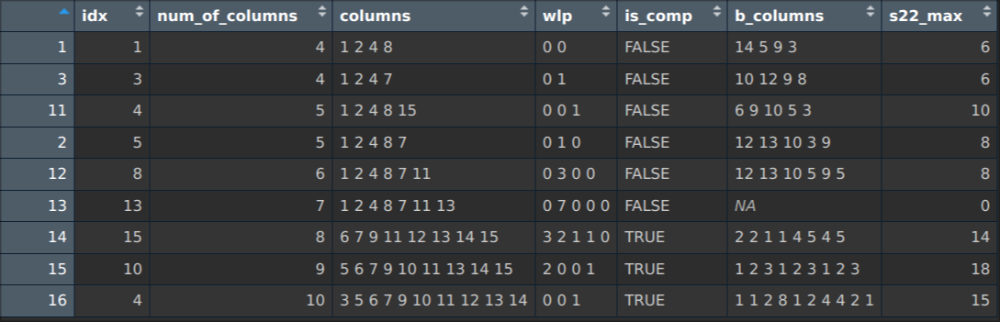
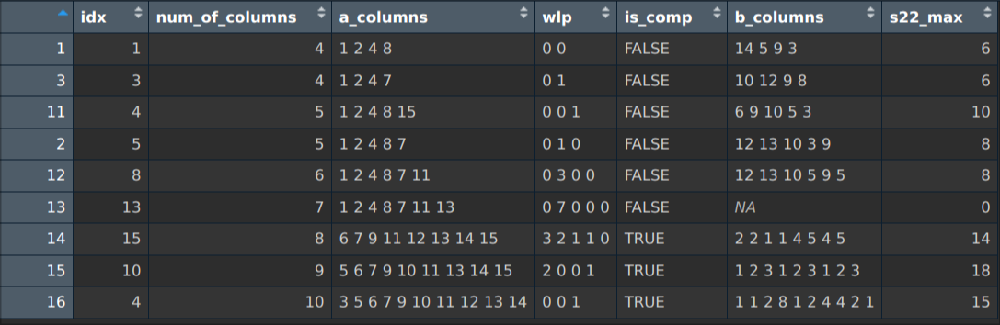
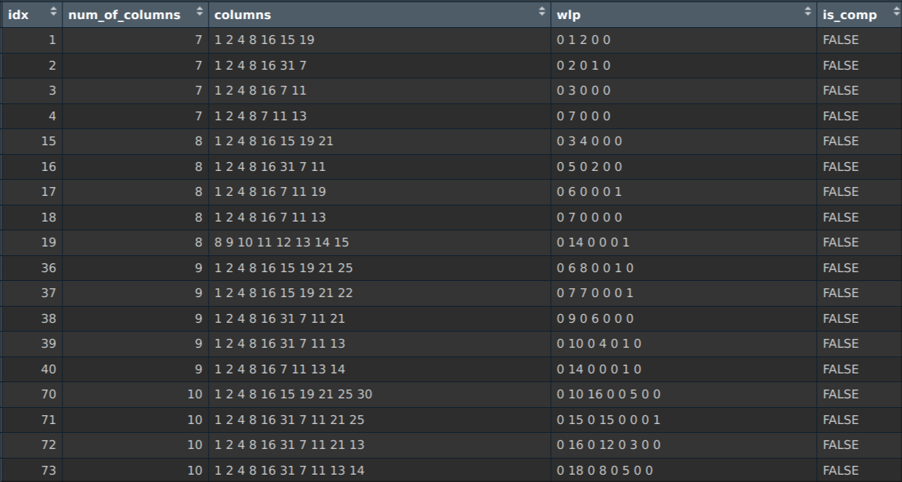
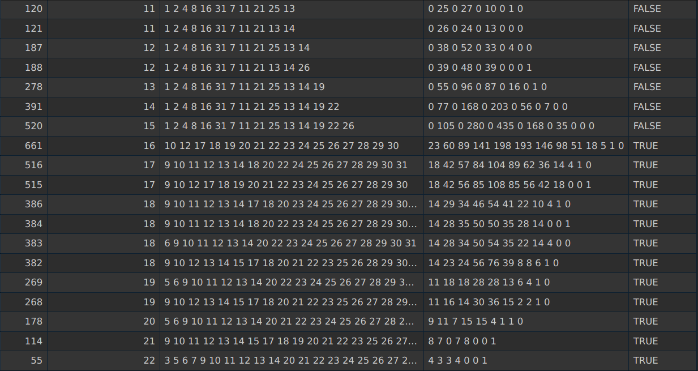

<!-- _class: cover -->

 

# Weekly Meeting

Topic: Searching $s\times s\times s$ and $s^2\times s^2$ for $\text{SOA}(2+)$

 

Presenter: Heng-Tse Chou @ NTHU STAT

Date: Sept. 25, 2024

---

# This week

**Completed:**

- Greedy Algorithm
- 16 runs (Both $2\times 2\times 2$ and $2^2\times 2^2$)
- 32 runs ($2\times 2\times 2$)

**TODO:**

- Put results over Overleaf

---

# 16 runs, case I

Maximizing $2\times2\times2$, then $4\times4$.

---

# 16 runs, case II

Maximizing $4\times4$, then $2\times2\times2$.

---

# 32 runs

Exhaustive search for $2\times2\times2$ is instant.

---

# 32 runs

