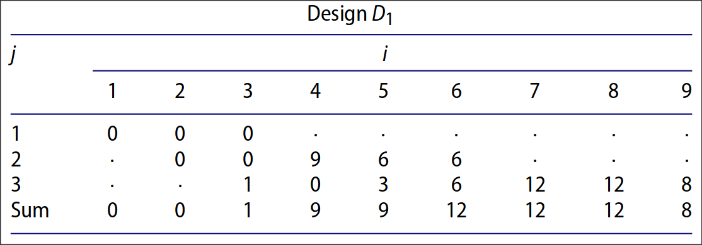

<!-- _class: cover -->

 

# Weekly Meeting

Topic: Construction of Optimal Designs under $\Sigma$-pattern

 

Presenter: Heng-Tse Chou @ NTHU STAT

Date: Aug. 8, 2024

---

# Notations

Consider a symmetric OA, $\text{OA}(n, m, s^p, t)$, $s$ denotes the base level.

$\mathbb{Z}_s = \{0, 1, \dots, s-1\}$ and $\mathbb{Z}_{s^p} = \{0, 1, \dots, s^p-1\}$ are collections of level settings.

1. For $x\in\mathbb{Z}_{s^p}$, let $f_i(x) = \lfloor x/s^{p-i}\rfloor \;\text{mod} \;s$, which represents the $i$th dight of $x$ in the base-$s$ numeral system.

2. Define $\rho(x) = p+1-\min\{i:f_i(x)\neq0,i=1,\dots,p\}$ if $x\neq0$ and $\rho(0)=0$. $\rho(x)$ represents the number of digits needed to express $x$ in the base-$s$ numeral system (after eliminating all the leading zeros).

---

# Notations

For $x \in \mathbb{Z}_{2^3}$,

$\begin{array}{|c|c|c|c|c|}
\hline
x & f_1(x) & f_2(x) & f_3(x) & \rho(x) \\
\hline
0 & 0 & 0 & 0 & 0 \\
1 & 0 & 0 & 1 & 1 \\
2 & 0 & 1 & 0 & 2 \\
3 & 0 & 1 & 1 & 2 \\
4 & 1 & 0 & 0 & 3 \\
5 & 1 & 0 & 1 & 3 \\
6 & 1 & 1 & 0 & 3 \\
7 & 1 & 1 & 1 & 3 \\
\hline
\end{array}$

---

# Notations

3. Define an inverse inner product between $u, x \in\mathbb{Z}_{s^p}$ by
   $\langle u,x\rangle = f_p(u)f_1(x) + \cdots f_1(u)f_p(x) = \sum_{i=1}^mf_{p-i+1}(u)f_i(x)$.

4. For $u, x \in\mathbb{Z}_{s^p}$, define $\chi_u(x) = \xi^{\langle u,x\rangle}$ where $\xi=\exp(2\pi \text{i}/s)$ with $\text{i}=(-1)^{1/2}.$

**Extend to m dimensions**

For $u = (u_1, \dots, u_m)\in\mathbb{Z}^m_{s^p}$ and $x = (x_1, \dots, x_m)\in\mathbb{Z}^m_{s^p}$,

- $\rho(u) = \sum_{i=1}^m\rho(u_i)$.
- $\chi_u(x) = \prod_{i=1}^m\chi_{u_i}(x_i)$.

---

# Characteristics

Let $D$ be a design with $n$ runs, $m$ columns and $s^p$ levels. For any $u \in \mathbb{Z}^m_{s^p}$,
define $\chi_u(D)=\sum_{x\in\text{D}}\chi_u(x)$, where $x$ is a row of $D$.

**Prop.**

The set of all $\chi_u(D)$ fully characterizes the properties of $D$ and uniquely determines $D$ once given by $n$ runs, $m$ columns and $s^p$ levels.

---

# Space-filling Pattern

For $j=0,\dots,mp$, define

$$S_j(D) = n^{-2}\sum_{\rho(u)=j}|\chi_u(D)|^2,$$

where the summation is over all $u \in \mathbb{Z}^m_{s^p}$ with $\rho(u) = j$.

The vector $(S_1(D), \dotsb, S_{mp}(D))$ is called the space-filling pattern.

---

# Space-filling Pattern

**Prop. 1**

If $S_j(D_1) = S_j(D_2)$ for $j = 1, ..., l$ and $S_{l+1}(D_1)<S_{l+1}(D_2)$, then $D_1$ is more space-filling than $D_2$. Design $D_1$ is the most space-filling if there is no other design that is more space-filling than $D_1$.

**Prop. 2**

If the first $j$ elements of the space-filling pattern are zeros, the general strong orthogonal array achieves stratification on any $s^j$ grids from projection.

e.g. If $S_2(D)=0$, then both $s^2$ grids on 1-dim and $s\times s$ on 2-dim grids achieve stratification.

---

# Stratification Pattern

For $u = (u_1, \dots, u_m)\in\mathbb{Z}^m_{s^p}$, define $wt(\textbf{u})$ by the number of non-zeroes in the vector $\textbf{u}$. Then, define stratification pattern by a $m\times mp$ matrix with

$$
\xi_{i,j}(D) = n^{-2}\sum_{wt(\textbf{u})=i}\sum_{\rho(\textbf{u})=j} |\chi_u(D)|^2
$$

Generally, $\xi_{i,j} = 0$ if $j<i$ or $j>ip$.

Minimizing $D$ sequentially by
$$(\xi_{1,1}(D), \xi_{1,2}(D), \xi_{2,2}(D), \dots, \xi_{1,p}(D),\dots, \xi_{p,p}(D) \dots, \xi_{2,p+1}(D), \dots, \xi_{p+1,p+1}(D),\dots, \xi_{m,mp}(D))$$
will give us a design with optimal stratification pattern.

---

# Stratification Pattern

Simply put, stratification pattern **prioritize dimensions over grids** while minimizing.

**Example (notations of $i$ and $j$ are switched)**

---

# $\Sigma$-pattern

With the similar settings of stratification patterns, instead we minimize $D$ by

$$
(\xi_{1,1}(D), \dots, \xi_{1,p}(D), \xi_{2,2}(D), \dots, \xi_{2,2p}(D), \dots, \xi_{m,m}(D),\dots,\xi_{m,mp}(D)).
$$

 

Simply put, $\Sigma$-pattern **prioritize grids over dimensions** while minimizing.

---

# $\Sigma$-pattern

**Example (notations of $i$ and $j$ are switched)**

---

# TODO

- Read SOA strength 2+, implement an algorithm if an design $A$ can be used to construct SOA 2+
