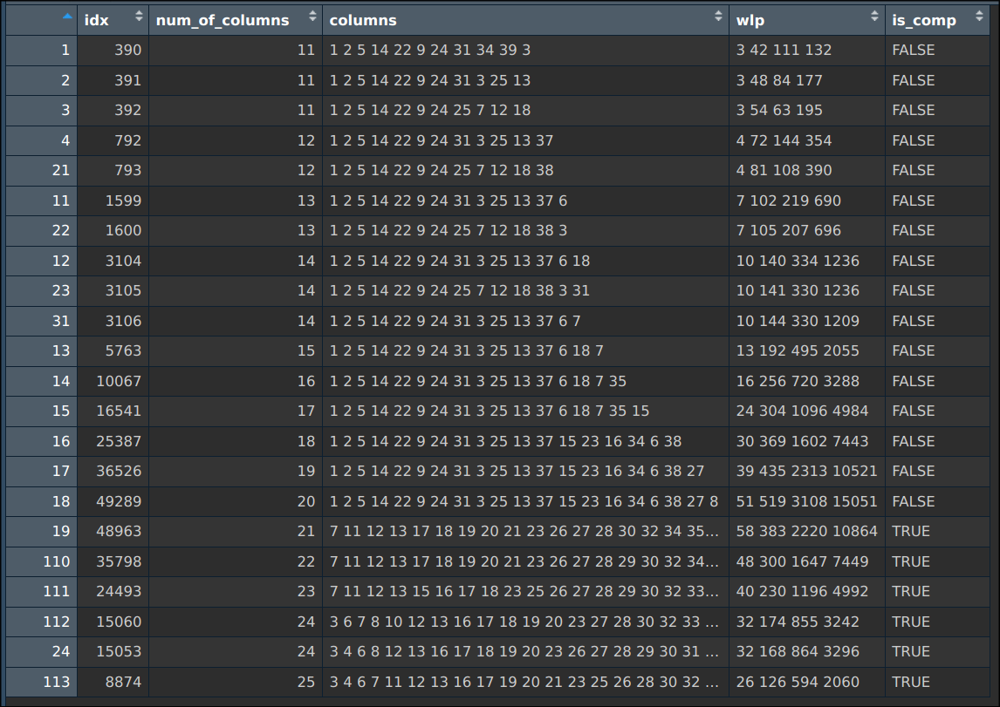
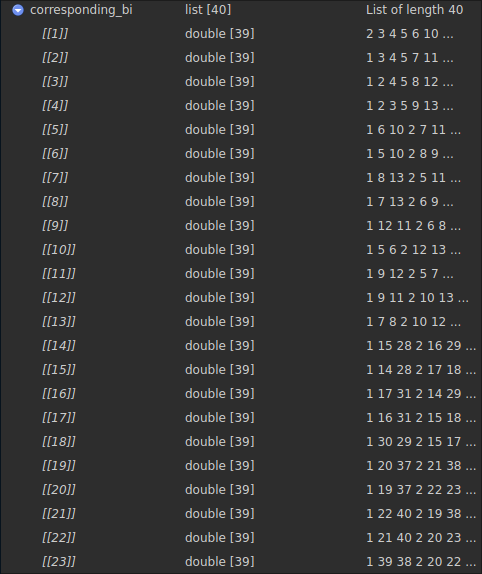

<!-- _class: cover -->

 

# Weekly Meeting

Topic: Algorithm for $3\times3\times3$ and $9\times9$

 

Presenter: Heng-Tse Chou @ NTHU STAT

Date: Sept. 11, 2024

---

# Result for finding $3\times3\times3$

---

# Property for finding $9\times9$

If $D = (d_1, \dots, d_m)$ is constructed via $D=A+B/2+3/2$, and $D$ is $\text{SOA}(2+)$, then for all $i\neq j$, the following statements are equivalent:

- $(d_i, d_j)$ achieve stratification over $s^2\times s^2$ grids.
- $(a_i, a_j, b_i, b_j)$ is $\text{OA}(n, 4, s, 4)$.
- $a_ib_i$, $a_jb_j$, $b_i$ and $b_j$ are different factors chosen from the saturated design $S$.

---

# An idea for $9\times9$

1. Fix $a_i$, find all possible $b_i$ that could form a line with $a_i$.
2. Make many design $B$ without duplicated factors.
3. For each $B$, calculate how many pair $(i, j)$ satisfies $(a_ib_i, a_jb_j, b_i, b_j)$ being different factors.
4. Select $B$ with the most pairs satisfying the condition.

---

# But...

