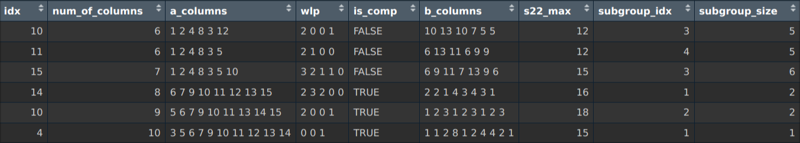
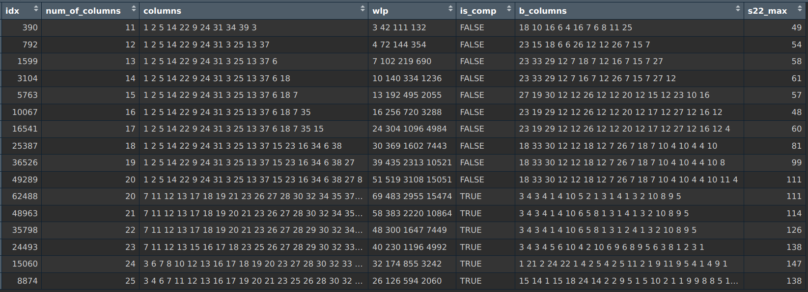
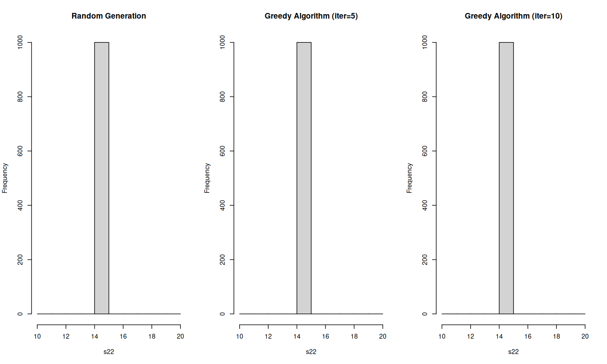
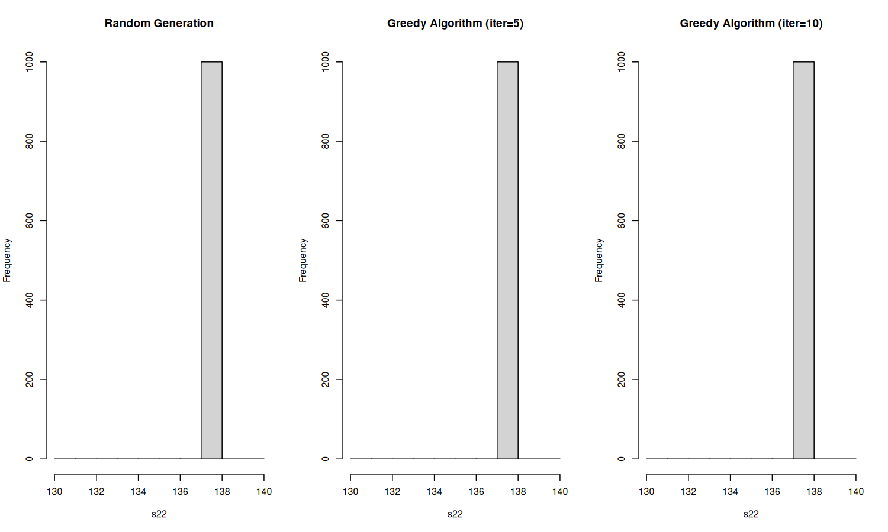

<!-- _class: cover -->

 

# Weekly Meeting

Topic: Search results and greedy algorithm experiments

 

Presenter: Heng-Tse Chou @ NTHU STAT

Date: Oct. 2, 2024

---

# 16 runs, 2x2x2 then 4x4

---

# 16 runs, 4x4 then 2x2x2

---

# 32 runs, 2x2x2 then 4x4

---

# 32 runs, 4x4 them 2x2x2

---

# 81 runs, 3x3x3 then 9x9

---

# 81 runs, 9x9 then 3x3x3

---

# Greedy algorithm experiments

For run size 16, 32 and 81, fix the design $A$ as

- First design for the smallest $m$
- First design for the largest $m$

Run the generation for design $B$ 1,000 times with

1. Random generation
2. Greedy algorithm with 5 iterations
3. Greedy algorithm with 10 iterations

Plot the frequencies of s22 as histograms.

---

# Greedy algorithm experiments

16 runs, m=6, columns=(1, 2, 4, 8, 7, 11).

---

# Greedy algorithm experiments

16 runs, m=10, columns=(3, 5, 6, 7, 9, 10, 11, 12, 13, 14).

---

# Greedy algorithm experiments

32 runs, m=10, columns=(1,2, 4, 8, 16, 15, 19, 21, 25, 30).

---

# Greedy algorithm experiments

32 runs, m=22, columns=(3, 5, 6, 7, 9, 10, 11, 12, 13, 14, 17, 18, 20, 23, 24, 25, 26, 27, 28, 29, 30, 31).

---

# Greedy algorithm experiments

81 runs, m=11, columns=(1, 2, 5, 14, 22, 9, 24, 31, 34, 39, 3).

---

# Greedy algorithm experiments

81 runs, m=25, columns=(4, 6, 7, 8, 11, 13, 15, 16, 17, 18, 19, 20, 21, 23, 25, 26, 28, 32, 33, 35, 36, 37, 38, 39, 40).

